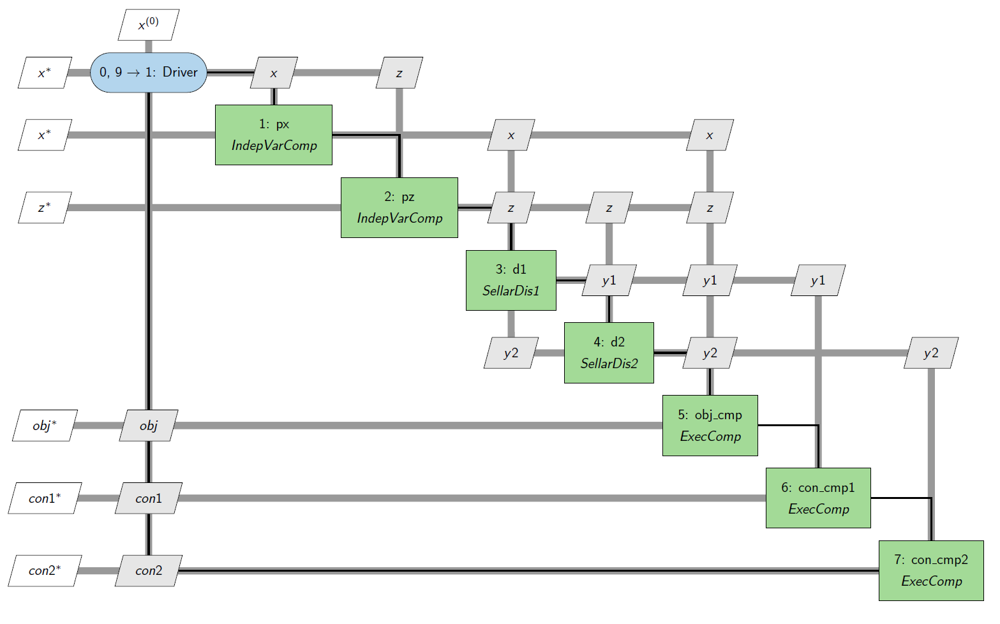

# OpenMDAO-XDSM
[XDSM][0] viewer plugin for [OpenMDAO][5].

Example of the Sellar problem modeled in OpenMDAO and vizualized with this package:
 

More detailed documentation can be found in the `omxdsm/docs` folder.

## Installation

The package can be installed from the [Github repository][1]

Install the package using pip:

    pip install omxdsm@https://github.com/onodip/OpenMDAO-XDSM/tarball/master

With the  installation XDSM diagrams can be created  in HTML format using 
[XDSMjs][2] or in TeX (and PDF) format using the [pyXDSM][3] package.

## Testing
Run the tests in `omxdsm/tests/test_xdsm_viewer.py`
For development, setting the variables `DEBUG=True` and `SHOW=True` in this file will save the outputs of test 
functions and open them in the default browser and PDF viewer.

## OpenMDAO compatibility
This package was created after the introduction of the OpenMDAO [plugin system][4]. In OpenMDAO versions between 
2.7 and 3.0 it was part of the OpenMDAO package. The package is compatible with OpenMDAO versions above 3.0. 
OpenMDAO-XDSM should be able to vizualize Case Recorder data from older versions (at least >=2.7), although some 
vizualization options might not be available.

[0]: http://mdolab.engin.umich.edu/content/xdsm-overview
[1]: https://github.com/onodip/OpenMDAO-XDSM
[2]: https://github.com/OneraHub/XDSMjs
[3]: https://github.com/mdolab/pyXDSM
[4]: http://openmdao.org/twodocs/versions/3.0.0/features/experimental/plugins.html
[5]: https://openmdao.org/